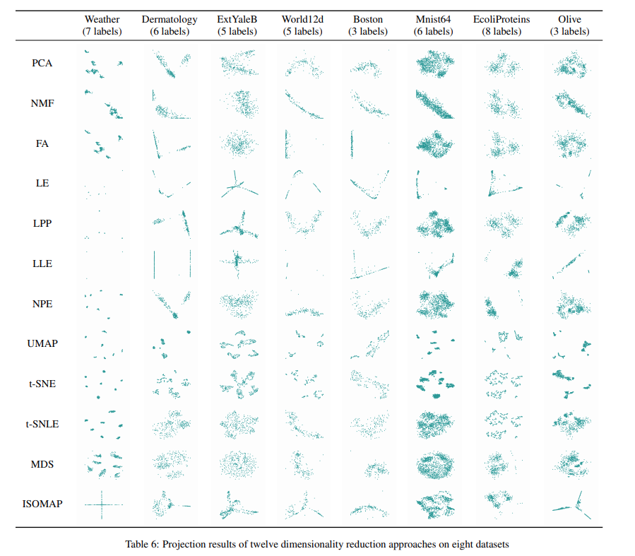

## DR approaches

The folder `DR approaches` contains the DR approaches used in our evaluation.

Below is the code to run DR approaches, provided in `approaches.py` :

```python
import os
from sklearn.decomposition import PCA, FactorAnalysis, NMF
from sklearn.manifold import TSNE, Isomap, MDS, LocallyLinearEmbedding, SpectralEmbedding
from sklearn.manifold import TSNLE
from sklearn import preprocessing
import numpy as np
import umap

def getLe(data, k):
    le = SpectralEmbedding(n_components=2, n_neighbors=k)
    result = le.fit_transform(data)
    return result

def getLle(data, k):
    mds = LocallyLinearEmbedding(n_neighbors=k, n_components=2, max_iter=200)
    result = mds.fit_transform(data)
    return result

def getIsomap(data, k):
    isomap = Isomap(n_neighbors=k, n_components=2)
    result = isomap.fit_transform(data)
    return result

def getMds(data, k):
    mds = MDS(n_components=2, max_iter=500)
    result = mds.fit_transform(data)
    return result

def getTsne(data, k):
    tsne = TSNE(n_components=2, perplexity=k, early_exaggeration=6, n_iter=3000)
    result = tsne.fit_transform(data)
    return result

def getTsnle(data, k):
    tsnle = TSNLE(n_components=2, perplexity=k, early_exaggeration=6, n_iter=3000)
    result = tsnle.fit_transform(data)
    return result

def getPca(data, k):
    pca = PCA(n_components=2)
    result = pca.fit_transform(data)
    return result

def getFA(data, k):
    fa = FactorAnalysis(n_components=2, max_iter=2000)
    result = fa.fit_transform(data)
    return result

def getNMF(data, k):
    nmf = NMF(n_components=2, max_iter=400)
    result = nmf.fit_transform(data)
    return result

def getUmap(data, k):
    result = umap.UMAP(n_neighbors=k).fit_transform(data)
    return result


if __name__ == '__main__':
    dataRootPath = './Data/'
    dataNameList = os.listdir(dataRootPath)
    k = 10
    for dataName in dataNameList:
        print(dataName)
        dataPath = dataRootPath + dataName + '/' + dataName + '.csv'
        labelPath = dataRootPath + dataName + '/' + dataName + '-label.csv'
        data = np.loadtxt(open(dataPath, "rb"), delimiter=",", skiprows=0)
        label = np.loadtxt(open(labelPath, "rb"), delimiter=",", skiprows=0)
        data = preprocessing.MinMaxScaler().fit_transform(data)
        tsneResult = getTsne(data, k)
        leResult = getLe(data, k)
        isomapResult = getIsomap(data, k)
        mdsResult = getMds(data, k)
        tsnleResult = getTsnle(data, k)
        pcaResult = getPca(data, k)
        lleResult = getLle(data, k)
        faResult = getFA(data, k)
        nmfResult = getNMF(data, k)
        umapResult = getUmap(data, k)

        filePath = dataRootPath + dataName + '/'
        np.savetxt(filePath + "tsne.csv", tsneResult, delimiter=",")
        np.savetxt(filePath + "le.csv", leResult, delimiter=",")
        np.savetxt(filePath + "isomap.csv", isomapResult, delimiter=",")
        np.savetxt(filePath + "mds.csv", mdsResult, delimiter=",")
        np.savetxt(filePath + "tsnle.csv", tsnleResult, delimiter=",")
        np.savetxt(filePath + "pca.csv", pcaResult, delimiter=",")
        np.savetxt(filePath + "lle.csv", lleResult, delimiter=",")
        np.savetxt(filePath + "fa.csv", faResult, delimiter=",")
        np.savetxt(filePath + "nmf.csv", nmfResult, delimiter=",")
        np.savetxt(filePath + "umap.csv", umapResult, delimiter=",")
```


## Datasets

The folder `Data` contains the datasets in the *csv* format used in our study.


Direct link: https://github.com/DR-approach/DR-approaches/tree/main/Data


The basic information of these datasets is as follows:

| Name          | Data Items | Dimensions | Clusters |
| ------------- | ---------- | ---------- | -------- |
| EcoliProteins | 336        | 7          | 8        |
| Dermatology   | 259        | 34         | 6        |
| ExtYaleB      | 320        | 30         | 5        |
| World12d      | 151        | 12         | 5        |
| Boston        | 155        | 13         | 3        |
| Mnist64       | 1083       | 64         | 6        |
| Weather       | 366        | 194        | 7        |
| Olive         | 572        | 8          | 3        |


The projection results of 12 dimensionality reduction approaches on 8 datasets are as follows: 




## Trial data

The folder `trial data` contains the trial data of our evaluation.

You can obtain our analysis results by directly run `compute.py`.


